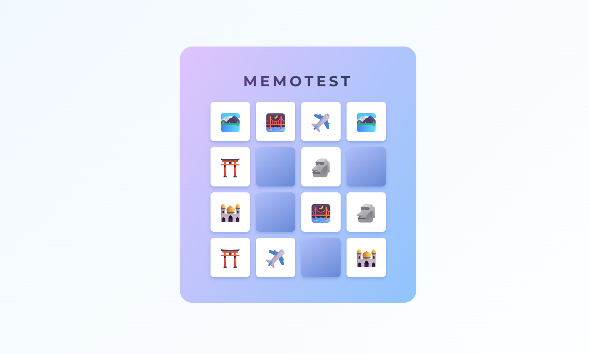

## Memotest con React 🎴
Juego de memoria para encontrar pares de cartas usando React y Vite. Proyecto realizado para el curso de r/argentina-programa para la tarea de la clase 2 de react. 

🔗 **[Demo en Vivo]()**  

## 🛠 Tecnologías usadas

- React
- Vite 
- CSS

## Capturas de pantalla 
  
  
  